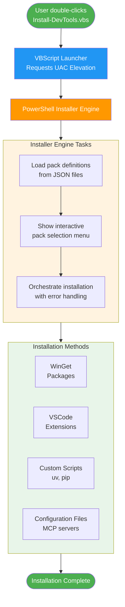
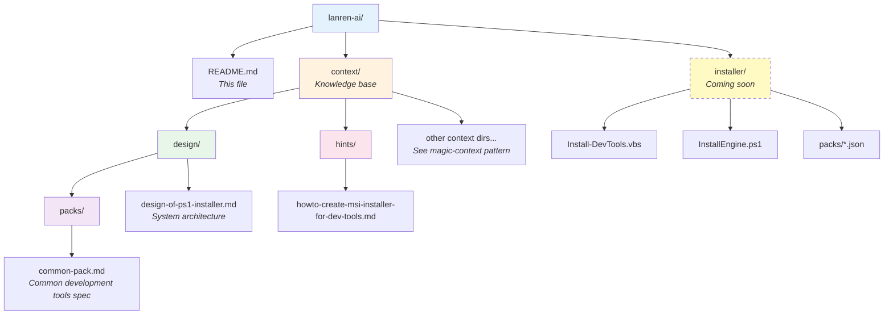

# Lanren AI (懒人 AI)

**One-Click Installers for AI Development Tools**

Lanren AI is a modular installer system that simplifies the setup of AI-powered coding tools and development environments. The name "懒人" (Lanren) means "lazy person" in Chinese, reflecting our mission: making AI development tools accessible to everyone with just a double-click—no command-line expertise required.

## Vision

AI coding tools are powerful, but their setup can be intimidating for newcomers. This project aims to:

- Provide one-click installers for popular AI coding tools via simple double-click
- Automate environment configuration and dependency management
- Eliminate the need for manual command-line setup
- Support multiple tool "packs" that users can choose from
- Create a seamless onboarding experience for developers new to AI-assisted coding

## Target Audience

- Developers new to AI coding tools
- Users who prefer double-click installation over CLI
- Teams wanting standardized AI tool configurations
- Anyone who values convenience and wants to get started quickly

## Implementation Approach

Lanren AI uses a **lightweight, modular architecture** built on:

- **VBScript Launcher**: Double-click entry point with UAC elevation
- **PowerShell Installer Engine**: Core installation orchestration
- **JSON Pack Definitions**: Modular, extensible tool pack configurations
- **WinGet Integration**: Leverages Windows Package Manager for installations

### Why This Approach?

- ✅ **No compilation needed**: Just text files (VBS, PS1, JSON)
- ✅ **No code signing required**: VBScript bypasses PowerShell execution policy
- ✅ **True one-click**: Users double-click a .vbs file and click "Yes" on UAC
- ✅ **Highly extensible**: Add new packs by creating JSON files
- ✅ **Maintainable**: Easy to update without rebuilding executables

## Available Tool Packs

### Common Development Tools Pack
Essential tools for AI-assisted development:
- **AI CLIs**: Claude Code CLI, OpenAI Codex CLI
- **Editor**: Visual Studio Code with AI extensions (Cline, Claude Code, Kilo Code)
- **Runtimes**: Node.js, Python tools (uv, pixi)
- **Utilities**: jq, yq, pandoc, markitdown
- **MCP Servers**: Tavily (search), Context7 (docs), Browser MCP

See [`context/design/packs/common-pack.md`](context/design/packs/common-pack.md) for complete details.

### Future Packs (Planned)
- **AI Development Pack**: Python AI libraries, Jupyter, LangChain, vector databases
- **Web Development Pack**: Frontend frameworks, live server, webpack, browser tools
- **Database Tools Pack**: PostgreSQL, MongoDB, DBeaver, Redis
- **Security Tools Pack**: Wireshark, Nmap, security analysis tools

## Architecture

See [`context/design/design-of-ps1-installer.md`](context/design/design-of-ps1-installer.md) for complete architecture with Mermaid diagrams.

## Technology Stack

- **Launcher**: VBScript (universal Windows compatibility)
- **Installer Engine**: PowerShell 5.1+ (built into Windows)
- **Package Manager**: WinGet (Microsoft's official package manager)
- **Configuration**: JSON (pack definitions)
- **Platform**: Windows 10+ (Ubuntu support via WSL for some tools)

**No external dependencies needed** - runs on any Windows 10+ machine with PowerShell.

## Project Structure

## Features

### Current Implementation Design

- ✅ **Pack-Based System**: Modular JSON definitions for tool collections
- ✅ **Interactive Selection**: Console-based menu to choose packs
- ✅ **Multiple Installation Types**: WinGet, direct download, custom scripts, config files
- ✅ **Dependency Management**: Items can depend on other items
- ✅ **Error Handling**: Retry logic, rollback, detailed logging
- ✅ **Verification**: Post-install checks for each tool
- ✅ **Progress Tracking**: Real-time progress with detailed logs

### Planned Features

- [ ] **GUI Installer**: Optional WPF-based graphical interface
- [ ] **Update Mechanism**: Check for pack updates
- [ ] **Uninstall Support**: Remove installed packs cleanly
- [ ] **Pack Repository**: Online repository for community packs
- [ ] **Profile Support**: Save/load installation profiles
- [ ] **Offline Mode**: Full offline installation with cached packages

## Getting Started

### For Users

*Coming soon*: Download the installer package, double-click `Install-DevTools.vbs`, and select the packs you want.

### For Developers

1. **Read the architecture**: [`context/design/design-of-ps1-installer.md`](context/design/design-of-ps1-installer.md)
2. **Understand the pack format**: [`context/design/packs/common-pack.md`](context/design/packs/common-pack.md)
3. **Implementation guide**: [`context/hints/howto-create-msi-installer-for-dev-tools.md`](context/hints/howto-create-msi-installer-for-dev-tools.md)

### Creating a New Pack

To add a new tool pack:

1. Create `context/design/packs/your-pack.md` with tool specifications
2. Create `installer/packs/your-pack.json` following the schema
3. Test installation independently
4. Submit a pull request

**No code changes required** - the installer auto-discovers new packs!

## Documentation

Comprehensive documentation is available in the `context/` directory:

| Document | Description |
|----------|-------------|
| [`context/design/design-of-ps1-installer.md`](context/design/design-of-ps1-installer.md) | Complete system architecture with Mermaid diagrams |
| [`context/design/packs/common-pack.md`](context/design/packs/common-pack.md) | Common tools pack specification and installation methods |
| [`context/hints/howto-create-msi-installer-for-dev-tools.md`](context/hints/howto-create-msi-installer-for-dev-tools.md) | Implementation guide with 4 approaches |

## Project Status

**Phase**: Design & Architecture Complete ✅

- ✅ Architecture designed (4-layer modular system)
- ✅ Pack definition schema created
- ✅ Common development tools pack specified
- ✅ Installation methods documented
- ✅ Error handling and logging designed
- 🚧 Implementation in progress

**Next Steps**:
1. Implement PowerShell installer engine
2. Create JSON pack definitions
3. Build VBScript launcher
4. Test with common-pack tools
5. Release v1.0 installer

## Contributing

Contributions are welcome! Here's how you can help:

- **Add tool packs**: Create specifications for new tool collections
- **Improve installation methods**: Add support for new installation types
- **Test on different systems**: Report compatibility issues
- **Documentation**: Improve guides and examples
- **Bug reports**: Open issues for problems you encounter

## License

TBD (will be added soon)

## Why "Lanren" (懒人)?

In Chinese culture, being "lazy" in the right way means finding efficient solutions to avoid repetitive work. This project embodies that philosophy: invest time once to build a great installer, then everyone benefits from one-click simplicity.

---

**Note**: This project follows the [magic-context pattern](https://github.com/context-labs/magic-context) for documentation and knowledge management. All design decisions, specifications, and implementation guides are documented in the `context/` directory.
