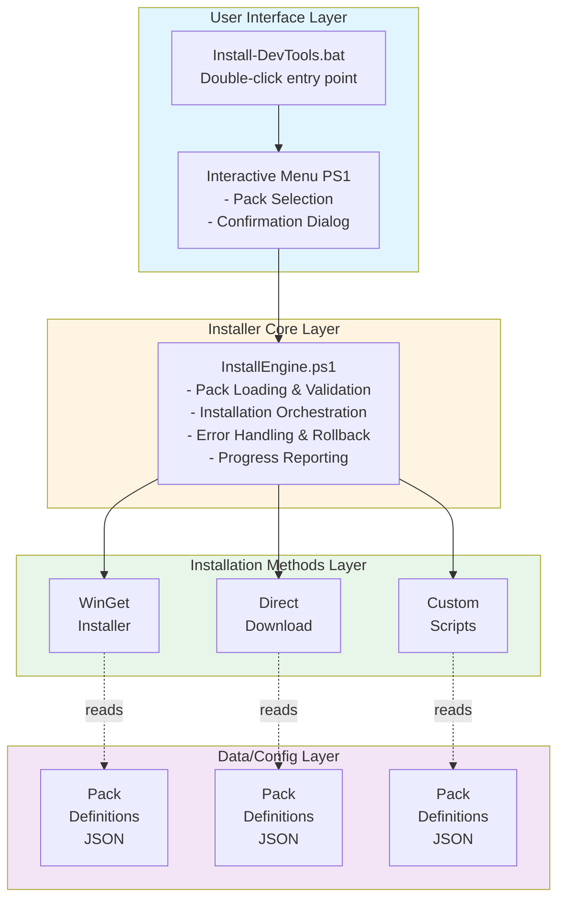
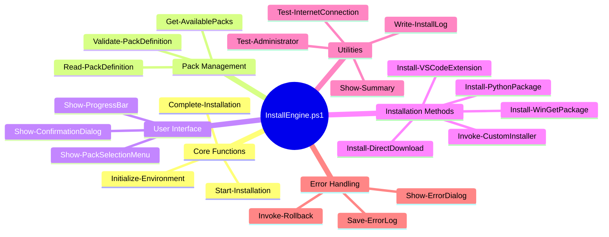

# Design of PowerShell-Based Package Installer System

## HEADER
- **Purpose**: Architectural design for a generic, modular PowerShell installer system that supports multiple tool packs with user selection
- **Status**: Active
- **Date**: 2025-12-01
- **Dependencies**: Windows 10+, PowerShell 5.1+, WinGet
- **Target**: Developers implementing the installer system

## Overview

This document describes the design of a generic, extensible PowerShell-based installer system that allows users to install predefined "packs" of development tools via a simple double-click experience. The system uses batch (`.bat`) launchers to bypass execution policy restrictions and provides a simple console-based pack selection UI.

### Goals

1. **User-Friendly**: Non-technical users can install tools by double-clicking
2. **Modular**: Easy to add new tool packs without modifying core installer
3. **Flexible**: Users can select which packs to install
4. **Maintainable**: Pack definitions are separate from installer logic
5. **Robust**: Comprehensive error handling, logging, and rollback capabilities
6. **Extensible**: Support for different installation methods (WinGet, direct download, custom scripts)

### Non-Goals

- Complex dependency resolution between packs
- Version management and upgrades (Phase 2)
- GUI installer wizard (use simple console/dialog-based UI)
- Cross-platform support (Windows only)

---

## Architecture

### High-Level Architecture



---

## Component Design

### 1. Launcher Component

**File**: `Install-DevTools.bat`

**Responsibilities**:
- Entry point for user (double-click target)
- Request UAC elevation
- Launch PowerShell installer with execution policy bypass
- Display initial confirmation dialog

**Implementation (batch)**:

```bat
@echo off
setlocal

rem Batch launcher - handles UAC elevation and execution policy bypass
rem Launches the main PowerShell installer script

set "SCRIPT_DIR=%~dp0"
set "PS1_FILE=%SCRIPT_DIR%InstallEngine.ps1"

net session >nul 2>&1
if %errorlevel% neq 0 (
    echo Requesting administrative privileges...
    powershell -NoLogo -NoProfile -Command "Start-Process -FilePath '%~f0' -Verb RunAs"
    exit /b
)

if not exist "%PS1_FILE%" (
    echo Error: InstallEngine.ps1 not found:
    echo   "%PS1_FILE%"
    pause
    exit /b 1
)

powershell -NoLogo -NoProfile -ExecutionPolicy Bypass -File "%PS1_FILE%"
set "EXITCODE=%ERRORLEVEL%"
endlocal & exit /b %EXITCODE%
```

**Design Decisions**:
- Batch chosen for simplicity and familiarity on Windows
- Execution policy bypass handled via PowerShell invocation flags
- Minimal logic - all intelligence in PowerShell layer
- Graceful error handling for missing files and elevation failures

---

### 2. Installer Engine Component

**File**: `InstallEngine.ps1`

**Responsibilities**:
- Load and validate pack definitions
- Present pack selection UI
- Orchestrate installation process
- Handle errors and logging
- Report progress to user

**Key Functions**:

```powershell
# Main entry point
function Start-Installation {
    # 1. Initialize logging
    # 2. Load pack definitions
    # 3. Display pack selection menu
    # 4. Confirm installation
    # 5. Execute installation
    # 6. Generate summary report
}

# Load all pack definitions from packs/ directory
function Get-AvailablePacks {
    # Returns: Array of Pack objects
}

# Display interactive menu for pack selection
function Show-PackSelectionMenu {
    param($Packs)
    # Returns: Array of selected pack IDs
}

# Install a single pack
function Install-Pack {
    param($PackDefinition)
    # Executes installation based on pack type
}

# Install via WinGet
function Install-WinGetPackage {
    param($PackageId, $PackageName)
}

# Install VSCode extension
function Install-VSCodeExtension {
    param($ExtensionId, $ExtensionName)
}

# Execute custom PowerShell script
function Invoke-CustomInstaller {
    param($ScriptPath, $Arguments)
}

# Error handling and rollback
function Invoke-Rollback {
    param($InstalledItems)
}

# Logging utilities
function Write-InstallLog {
    param($Message, $Level)
}
```

**Module Structure**:



---

### 3. Pack Definition Component

**Location**: `packs/*.json`

**Responsibilities**:
- Define pack metadata (name, description, version)
- List all items to install
- Specify installation method for each item
- Define dependencies and prerequisites

**Pack Definition Schema**:

```json
{
  "schema_version": "1.0",
  "pack": {
    "id": "common-pack",
    "name": "Common Development Tools",
    "description": "Essential tools for AI-assisted development: VSCode, Claude Code CLI, Node.js, Python tools, utilities, and MCP servers",
    "version": "1.0.0",
    "category": "development",
    "tags": ["ai", "development", "essential"]
  },
  "prerequisites": {
    "windows_version": "10.0",
    "powershell_version": "5.1",
    "internet_required": true,
    "disk_space_mb": 5000
  },
  "items": [
    {
      "id": "vscode",
      "name": "Visual Studio Code",
      "type": "winget",
      "install": {
        "package_id": "Microsoft.VisualStudioCode",
        "silent": true
      },
      "verify": {
        "command": "code --version",
        "type": "command_exists"
      }
    },
    {
      "id": "nodejs",
      "name": "Node.js LTS",
      "type": "winget",
      "install": {
        "package_id": "OpenJS.NodeJS.LTS",
        "silent": true
      },
      "verify": {
        "command": "node --version",
        "type": "version_check",
        "min_version": "18.0.0"
      }
    },
    {
      "id": "python-extension",
      "name": "Python Extension for VSCode",
      "type": "vscode_extension",
      "install": {
        "extension_id": "ms-python.python"
      },
      "dependencies": ["vscode"]
    },
    {
      "id": "uv",
      "name": "uv - Python Package Manager",
      "type": "custom_script",
      "install": {
        "script": "irm https://astral.sh/uv/install.ps1 | iex",
        "script_type": "inline"
      },
      "verify": {
        "command": "uv --version",
        "type": "command_exists"
      }
    },
    {
      "id": "jq",
      "name": "jq - JSON Processor",
      "type": "winget",
      "install": {
        "package_id": "jqlang.jq",
        "silent": true
      }
    },
    {
      "id": "markitdown",
      "name": "MarkItDown via uv",
      "type": "custom_script",
      "install": {
        "script": "uv tool install markitdown",
        "script_type": "inline"
      },
      "dependencies": ["uv"]
    },
    {
      "id": "context7-mcp",
      "name": "Context7 MCP Server",
      "type": "config_file",
      "install": {
        "target_path": "%APPDATA%/Claude/claude_desktop_config.json",
        "template": "templates/context7-mcp-config.json",
        "merge_strategy": "json_merge"
      },
      "post_install": {
        "message": "Please configure your Context7 API key in Claude Desktop settings"
      }
    }
  ],
  "post_install": {
    "message": "Common Development Tools installed successfully!\n\nNext steps:\n1. Restart your terminal for PATH changes\n2. Configure MCP servers with API keys\n3. Run 'code --version' to verify VSCode installation",
    "open_urls": [
      "https://tavily.com/api-key",
      "https://docs.anthropic.com/en/docs/claude-code/setup"
    ]
  }
}
```

**Item Types**:

| Type | Description | Example |
|------|-------------|---------|
| `winget` | Install via WinGet | VSCode, Node.js, jq |
| `vscode_extension` | VSCode extension via CLI | Python extension |
| `custom_script` | Run PowerShell script | uv installer |
| `direct_download` | Download and install | Portable tools |
| `config_file` | Create/modify config | MCP server config |
| `npm_package` | Install global npm package | TypeScript |
| `python_package` | Install via pip/uv | Python tools |

---

### 4. User Interface Component

**Console-Based Interactive Menu**:

```
╔══════════════════════════════════════════════════════════╗
║         Development Tools Installer v1.0                 ║
╚══════════════════════════════════════════════════════════╝

Available Tool Packs:

 [1] ☐ Common Development Tools (Essential)
     └─ VSCode, Claude Code CLI, Node.js, Python tools, utilities
     └─ Size: ~500 MB | Items: 15

 [2] ☐ AI Development Pack
     └─ OpenAI Codex CLI, Python AI libraries, Jupyter
     └─ Size: ~2 GB | Items: 22

 [3] ☐ Web Development Pack
     └─ Browser tools, live server, webpack, frontend frameworks
     └─ Size: ~800 MB | Items: 18

 [4] ☐ Database Tools Pack
     └─ PostgreSQL, MongoDB, DBeaver, Redis
     └─ Size: ~1.5 GB | Items: 12

─────────────────────────────────────────────────────────────

Enter numbers to select packs (e.g., "1,3" or "all"): _

Press 'q' to quit
```

**Implementation Approach**:

```powershell
function Show-PackSelectionMenu {
    param([array]$Packs)

    $selectedIndices = @()

    while ($true) {
        Clear-Host

        # Display header
        Write-Header "Development Tools Installer"

        # Display packs
        for ($i = 0; $i -lt $Packs.Count; $i++) {
            $pack = $Packs[$i]
            $checkbox = if ($i -in $selectedIndices) { "☑" } else { "☐" }

            Write-Host " [$($i+1)] $checkbox $($pack.name)" -ForegroundColor Cyan
            Write-Host "     └─ $($pack.description)" -ForegroundColor Gray
            Write-Host "     └─ Size: $($pack.size) | Items: $($pack.itemCount)" -ForegroundColor DarkGray
            Write-Host ""
        }

        # Get user input
        $input = Read-Host "Enter numbers to select packs (e.g., '1,3' or 'all')"

        if ($input -eq 'q') { return $null }
        if ($input -eq 'all') { return 0..($Packs.Count-1) }

        # Parse selection
        try {
            $selectedIndices = $input.Split(',') | ForEach-Object {
                [int]$_.Trim() - 1
            } | Where-Object { $_ -ge 0 -and $_ -lt $Packs.Count }

            if ($selectedIndices.Count -gt 0) {
                return $selectedIndices
            }
        } catch {
            Write-Host "Invalid input. Please try again." -ForegroundColor Red
            Start-Sleep -Seconds 2
        }
    }
}
```

---

## File Structure

```mermaid
graph TD
    Root[installer/]

    Root --> BAT[Install-DevTools.bat<br/><i>Batch launcher (.bat)</i>]
    Root --> Engine[InstallEngine.ps1<br/><i>Main installer engine</i>]
    Root --> README[README.md<br/><i>User documentation</i>]

    Root --> Packs[packs/]
    Packs --> Pack1[common-pack.json]
    Packs --> Pack2[ai-pack.json]
    Packs --> Pack3[web-pack.json]
    Packs --> Pack4[database-pack.json]

    Root --> Modules[modules/]
    Modules --> Mod1[PackManager.psm1]
    Modules --> Mod2[InstallMethods.psm1]
    Modules --> Mod3[UIComponents.psm1]
    Modules --> Mod4[Utilities.psm1]

    Root --> Templates[templates/]
    Templates --> Temp1[context7-mcp-config.json]
    Templates --> Temp2[tavily-mcp-config.json]
    Templates --> Temp3[vscode-extensions.json]

    Root --> Scripts[scripts/]
    Scripts --> Script1[install-uv.ps1]
    Scripts --> Script2[configure-mcp-servers.ps1]
    Scripts --> Script3[setup-python-env.ps1]

    Root --> Logs[logs/<br/><i>Created at runtime</i>]
    Logs --> Log1[install-2025-12-01.log]
    Logs --> Log2[errors-2025-12-01.log]

    style Root fill:#e3f2fd
    style Packs fill:#fff3e0
    style Modules fill:#f3e5f5
    style Templates fill:#e8f5e9
    style Scripts fill:#fce4ec
    style Logs fill:#fff9c4
```

---

## Installation Workflow

```mermaid
flowchart TD
    Start([User double-clicks<br/>Install-DevTools.bat]) --> UAC[Batch launcher requests<br/>UAC elevation via PowerShell]
    UAC --> Launch[PowerShell launches with<br/>ExecutionPolicy Bypass]
    Launch --> Init[InstallEngine.ps1 starts]

    subgraph Phase1["Phase 1: Initialization"]
        Init --> CheckAdmin{Check administrator<br/>privileges?}
        CheckAdmin -->|No| Error1[Error: Admin required]
        CheckAdmin -->|Yes| InitLog[Initialize logging system]
        InitLog --> CheckPrereq[Verify prerequisites<br/>Windows/PowerShell version]
        CheckPrereq --> CheckNet[Check internet connectivity]
    end

    CheckNet --> LoadPacks

    subgraph Phase2["Phase 2: Pack Selection"]
        LoadPacks[Load pack definitions<br/>from packs/*.json] --> Parse[Parse JSON files]
        Parse --> Validate[Validate schema]
        Validate --> BuildMeta[Build pack metadata<br/>size, item count]
        BuildMeta --> ShowMenu[Display pack selection menu]
        ShowMenu --> UserSelect[User selects packs<br/>1,3 or 'all']
        UserSelect --> ValidateSel[Validate selections]
        ValidateSel --> CalcSize[Calculate total download<br/>size and disk space]
        CalcSize --> Confirm[Show confirmation dialog]
    end

    Confirm --> InstallLoop

    subgraph Phase3["Phase 3: Installation"]
        InstallLoop[For each selected pack] --> ShowPack[Display pack name<br/>and description]
        ShowPack --> CheckPackPrereq[Check pack prerequisites]
        CheckPackPrereq --> ItemLoop[For each item in pack]

        ItemLoop --> AlreadyInstalled{Already<br/>installed?}
        AlreadyInstalled -->|Yes| Skip[Skip item]
        AlreadyInstalled -->|No| ShowProgress[Display progress:<br/>Installing X of Y]

        ShowProgress --> InstallType{Installation<br/>type?}
        InstallType -->|winget| WinGet[Run winget install]
        InstallType -->|vscode_ext| VSCode[Run code --install-extension]
        InstallType -->|custom| Custom[Execute PowerShell script]
        InstallType -->|config| Config[Create/merge config file]

        WinGet --> Verify[Verify installation]
        VSCode --> Verify
        Custom --> Verify
        Config --> Verify

        Verify --> Success{Success?}
        Success -->|Yes| LogSuccess[Log: Success]
        Success -->|No| Retry{Retry<br/>< 3 times?}

        Retry -->|Yes| ShowProgress
        Retry -->|No| UserChoice{User: Skip<br/>or Abort?}
        UserChoice -->|Skip| LogFail[Log: Failed]
        UserChoice -->|Abort| Rollback[Invoke rollback]

        Skip --> NextItem{More items?}
        LogSuccess --> NextItem
        LogFail --> NextItem

        NextItem -->|Yes| ItemLoop
        NextItem -->|No| NextPack{More packs?}
        NextPack -->|Yes| InstallLoop
    end

    NextPack -->|No| Summary

    subgraph Phase4["Phase 4: Completion"]
        Summary[Display installation summary] --> Stats[Show statistics:<br/>Total/Success/Failed/Skipped]
        Stats --> PostMsg[Show post-install messages]
        PostMsg --> URLs[Offer to open URLs<br/>API keys, docs]
        URLs --> RestartPrompt[Prompt to restart<br/>terminal/computer]
        RestartPrompt --> GenLog[Generate detailed log file]
    end

    GenLog --> End([Installation Complete])
    Error1 --> End
    Rollback --> End

    style Phase1 fill:#e3f2fd
    style Phase2 fill:#fff3e0
    style Phase3 fill:#e8f5e9
    style Phase4 fill:#f3e5f5
    style Start fill:#4caf50,color:#fff
    style End fill:#2196f3,color:#fff
    style Error1 fill:#f44336,color:#fff
    style Rollback fill:#ff9800,color:#fff
```



---

## Data Structures

### Pack Object

```powershell
@{
    Id = "common-pack"
    Name = "Common Development Tools"
    Description = "Essential tools for development"
    Version = "1.0.0"
    Category = "development"
    Tags = @("ai", "development")
    Prerequisites = @{
        WindowsVersion = "10.0"
        PowerShellVersion = "5.1"
        InternetRequired = $true
        DiskSpaceMB = 5000
    }
    Items = @(
        @{
            Id = "vscode"
            Name = "Visual Studio Code"
            Type = "winget"
            Install = @{
                PackageId = "Microsoft.VisualStudioCode"
                Silent = $true
            }
            Verify = @{
                Command = "code --version"
                Type = "command_exists"
            }
        }
        # ... more items
    )
    PostInstall = @{
        Message = "Installation complete!"
        OpenUrls = @("https://example.com")
    }
}
```

### Installation State

```powershell
@{
    StartTime = Get-Date
    SelectedPacks = @("common-pack", "ai-pack")
    TotalItems = 45
    CompletedItems = 0
    FailedItems = @()
    SkippedItems = @()
    LogFile = "logs/install-2025-12-01.log"
    ErrorLog = "logs/errors-2025-12-01.log"
}
```

### Installation Result

```powershell
@{
    ItemId = "vscode"
    ItemName = "Visual Studio Code"
    Status = "Success" # Success | Failed | Skipped
    Message = "Installed successfully"
    InstallTime = [TimeSpan]
    Error = $null # or exception object
}
```

---

## Installation Methods

### WinGet Installation

```powershell
function Install-WinGetPackage {
    param(
        [string]$PackageId,
        [string]$PackageName,
        [bool]$Silent = $true
    )

    Write-InstallLog "Installing $PackageName via WinGet..." "Info"

    # Check if WinGet is available
    if (-not (Test-WinGetInstalled)) {
        throw "WinGet is not installed"
    }

    # Build command
    $args = @("install", "--id", $PackageId)
    if ($Silent) {
        $args += @("--silent", "--accept-package-agreements", "--accept-source-agreements")
    }

    # Execute
    $output = & winget @args 2>&1

    if ($LASTEXITCODE -eq 0) {
        Write-InstallLog "Successfully installed $PackageName" "Success"
        return @{ Success = $true; Output = $output }
    } else {
        Write-InstallLog "Failed to install $PackageName: $output" "Error"
        return @{ Success = $false; Error = $output }
    }
}
```

### VSCode Extension Installation

```powershell
function Install-VSCodeExtension {
    param(
        [string]$ExtensionId,
        [string]$ExtensionName
    )

    Write-InstallLog "Installing VSCode extension: $ExtensionName" "Info"

    # Check if VSCode is installed
    if (-not (Test-CommandExists "code")) {
        throw "VSCode is not installed"
    }

    # Install extension
    $output = & code --install-extension $ExtensionId --force 2>&1

    if ($LASTEXITCODE -eq 0) {
        Write-InstallLog "Successfully installed extension: $ExtensionName" "Success"
        return @{ Success = $true }
    } else {
        Write-InstallLog "Failed to install extension: $output" "Error"
        return @{ Success = $false; Error = $output }
    }
}
```

### Custom Script Execution

```powershell
function Invoke-CustomInstaller {
    param(
        [string]$Script,           # Script content or path
        [string]$ScriptType,       # "inline" or "file"
        [hashtable]$Arguments = @{}
    )

    Write-InstallLog "Executing custom installation script" "Info"

    try {
        if ($ScriptType -eq "inline") {
            # Execute inline script
            $scriptBlock = [ScriptBlock]::Create($Script)
            $result = & $scriptBlock @Arguments
        } else {
            # Execute script file
            $result = & $Script @Arguments
        }

        Write-InstallLog "Custom script completed successfully" "Success"
        return @{ Success = $true; Result = $result }
    } catch {
        Write-InstallLog "Custom script failed: $_" "Error"
        return @{ Success = $false; Error = $_ }
    }
}
```

---

## Error Handling Strategy

### Error Types

1. **Prerequisite Failures**: Windows version, PowerShell version, internet
2. **Installation Failures**: Package not found, download failed, install error
3. **Verification Failures**: Installed but verification failed
4. **Dependency Failures**: Required dependency not installed

### Handling Approach

```powershell
function Install-Pack {
    param($PackDefinition)

    $results = @()

    try {
        foreach ($item in $PackDefinition.Items) {
            try {
                # Check dependencies
                $depsOk = Test-Dependencies $item.Dependencies
                if (-not $depsOk) {
                    throw "Dependencies not met"
                }

                # Check if already installed
                if (Test-ItemInstalled $item) {
                    $results += @{
                        Item = $item
                        Status = "Skipped"
                        Reason = "Already installed"
                    }
                    continue
                }

                # Attempt installation with retry
                $maxRetries = 3
                $attempt = 0
                $installed = $false

                while ($attempt -lt $maxRetries -and -not $installed) {
                    $attempt++

                    try {
                        Install-Item $item

                        # Verify installation
                        if (Test-ItemInstalled $item) {
                            $installed = $true
                            $results += @{
                                Item = $item
                                Status = "Success"
                            }
                        } else {
                            throw "Verification failed"
                        }
                    } catch {
                        if ($attempt -lt $maxRetries) {
                            Write-Warning "Attempt $attempt failed, retrying..."
                            Start-Sleep -Seconds 5
                        } else {
                            throw
                        }
                    }
                }

            } catch {
                # Item installation failed
                Write-Error "Failed to install $($item.Name): $_"

                $results += @{
                    Item = $item
                    Status = "Failed"
                    Error = $_
                }

                # Ask user to continue or abort
                $continue = Show-ErrorDialog -Item $item -Error $_
                if (-not $continue) {
                    throw "Installation aborted by user"
                }
            }
        }
    } catch {
        # Pack installation failed
        Write-Error "Pack installation failed: $_"

        # Optionally rollback
        $rollback = Show-RollbackDialog
        if ($rollback) {
            Invoke-Rollback $results
        }
    }

    return $results
}
```

---

## Logging System

### Log Levels

- **Debug**: Detailed diagnostic information
- **Info**: General informational messages
- **Success**: Successful operations
- **Warning**: Warning messages (non-critical)
- **Error**: Error messages (critical)

### Log Format

```
[2025-12-01 14:32:15] [INFO] Starting installation...
[2025-12-01 14:32:16] [INFO] Loading pack definitions...
[2025-12-01 14:32:17] [INFO] Found 4 packs
[2025-12-01 14:32:25] [INFO] User selected: common-pack, ai-pack
[2025-12-01 14:32:26] [INFO] Installing Visual Studio Code...
[2025-12-01 14:33:42] [SUCCESS] Visual Studio Code installed
[2025-12-01 14:33:43] [INFO] Installing Node.js LTS...
[2025-12-01 14:35:12] [SUCCESS] Node.js LTS installed
[2025-12-01 14:35:13] [WARNING] Python extension already installed, skipping
[2025-12-01 14:35:14] [ERROR] Failed to install jq: Package not found
[2025-12-01 14:35:15] [INFO] Retrying installation of jq (attempt 2/3)...
[2025-12-01 14:35:28] [SUCCESS] jq installed
```

### Implementation

```powershell
$script:LogFile = "logs/install-$(Get-Date -Format 'yyyy-MM-dd-HHmmss').log"
$script:ErrorLog = "logs/errors-$(Get-Date -Format 'yyyy-MM-dd-HHmmss').log"

function Write-InstallLog {
    param(
        [string]$Message,
        [ValidateSet("Debug", "Info", "Success", "Warning", "Error")]
        [string]$Level = "Info"
    )

    $timestamp = Get-Date -Format "yyyy-MM-dd HH:mm:ss"
    $logEntry = "[$timestamp] [$Level] $Message"

    # Write to console with color
    switch ($Level) {
        "Debug"   { Write-Host $logEntry -ForegroundColor Gray }
        "Info"    { Write-Host $logEntry -ForegroundColor White }
        "Success" { Write-Host $logEntry -ForegroundColor Green }
        "Warning" { Write-Host $logEntry -ForegroundColor Yellow }
        "Error"   { Write-Host $logEntry -ForegroundColor Red }
    }

    # Write to log file
    Add-Content -Path $script:LogFile -Value $logEntry

    # Write errors to separate error log
    if ($Level -eq "Error") {
        Add-Content -Path $script:ErrorLog -Value $logEntry
    }
}
```

---

## Extensibility

### Adding New Packs

To add a new pack:

1. Create a new JSON file in `packs/` directory
2. Follow the pack definition schema
3. Define items with appropriate types
4. Test pack installation independently
5. No changes to core installer required

**Example**: `packs/security-pack.json`

```json
{
  "schema_version": "1.0",
  "pack": {
    "id": "security-pack",
    "name": "Security Tools Pack",
    "description": "Security testing and analysis tools",
    "version": "1.0.0",
    "category": "security"
  },
  "items": [
    {
      "id": "wireshark",
      "name": "Wireshark",
      "type": "winget",
      "install": {
        "package_id": "WiresharkFoundation.Wireshark"
      }
    },
    {
      "id": "nmap",
      "name": "Nmap",
      "type": "winget",
      "install": {
        "package_id": "Insecure.Nmap"
      }
    }
  ]
}
```

### Adding New Installation Methods

To add a new installation method:

1. Add new type to schema (e.g., `"chocolatey"`)
2. Implement handler function in `InstallEngine.ps1`:

```powershell
function Install-ChocolateyPackage {
    param(
        [string]$PackageName,
        [hashtable]$Options
    )

    # Implementation
}
```

3. Add case to main installation switch:

```powershell
switch ($item.Type) {
    "winget" { Install-WinGetPackage @item.Install }
    "vscode_extension" { Install-VSCodeExtension @item.Install }
    "chocolatey" { Install-ChocolateyPackage @item.Install }  # New
    # ...
}
```

### Adding Custom Validators

```powershell
# In pack definition
"verify": {
    "type": "custom",
    "script": "scripts/verify-docker.ps1"
}

# In InstallEngine.ps1
function Test-ItemInstalled {
    param($Item)

    switch ($Item.Verify.Type) {
        "command_exists" { Test-CommandExists $Item.Verify.Command }
        "version_check" { Test-Version $Item.Verify.Command $Item.Verify.MinVersion }
        "custom" { & $Item.Verify.Script }
    }
}
```

---

## Configuration Options

### User-Configurable Settings

Create `config.json` for user preferences:

```json
{
  "preferences": {
    "auto_update_packs": false,
    "silent_install": true,
    "verify_installations": true,
    "retry_count": 3,
    "log_level": "Info",
    "create_restore_point": true
  },
  "paths": {
    "pack_directory": "packs",
    "log_directory": "logs",
    "temp_directory": "temp"
  },
  "network": {
    "timeout_seconds": 300,
    "proxy": null,
    "offline_mode": false
  }
}
```

---

## Testing Strategy

### Unit Testing

```powershell
# Test pack loading
Describe "Pack Loading" {
    It "Should load valid pack definition" {
        $pack = Read-PackDefinition "packs/common-pack.json"
        $pack.Id | Should -Be "common-pack"
    }

    It "Should reject invalid schema" {
        { Read-PackDefinition "packs/invalid.json" } | Should -Throw
    }
}

# Test installation methods
Describe "WinGet Installation" {
    It "Should install package successfully" {
        Mock winget { return 0 }
        $result = Install-WinGetPackage "Test.Package" "Test"
        $result.Success | Should -Be $true
    }
}
```

### Integration Testing

```powershell
# Test end-to-end installation
Describe "End-to-End Installation" {
    It "Should install selected packs" {
        # Create test pack with safe items
        # Run installer in test mode
        # Verify installations
    }
}
```

---

## Performance Considerations

### Optimization Strategies

1. **Parallel Installation**: Install independent items concurrently

```powershell
$jobs = @()
foreach ($item in $independentItems) {
    $jobs += Start-Job -ScriptBlock {
        param($item)
        Install-Item $item
    } -ArgumentList $item
}
$results = $jobs | Wait-Job | Receive-Job
```

2. **Caching**: Cache downloaded installers for retry/offline use

3. **Progress Reporting**: Show real-time progress without blocking

4. **Lazy Loading**: Load pack definitions on-demand

---

## Security Considerations

### Code Signing

- Sign PowerShell scripts for enterprise distribution
- (Optional) Sign batch launcher for improved trust on locked-down environments

### Input Validation

- Validate all JSON pack definitions against schema
- Sanitize user input in pack selection
- Validate URLs before download
- Check file hashes after download

### Privilege Management

- Run with least privilege necessary
- Only elevate when required (installation phase)
- Log all privileged operations

### Network Security

- Use HTTPS for all downloads
- Verify SSL certificates
- Support proxy configuration
- Validate downloaded file integrity

---

## Deployment

### Distribution Package

```
DevToolsInstaller-v1.0.0.zip
├── Install-DevTools.bat
├── InstallEngine.ps1
├── README.md
├── LICENSE.txt
├── packs/
│   ├── common-pack.json
│   ├── ai-pack.json
│   └── web-pack.json
└── templates/
    └── *.json
```

### User Instructions

```markdown
# Installation Instructions

1. Extract the ZIP file to a folder (e.g., C:\DevToolsInstaller)
2. Double-click `Install-DevTools.bat`
3. When UAC prompts, click "Yes"
4. Select the packs you want to install
5. Confirm installation
6. Wait for completion (may take 10-30 minutes)
7. Restart your terminal/computer if prompted

## Troubleshooting

- If antivirus blocks: Add folder to exclusions
- If installation fails: Check logs/ folder
- For help: See README.md or contact support
```

---

## Future Enhancements (Phase 2)

1. **GUI Installer**: WPF-based graphical installer
2. **Update Mechanism**: Check for pack updates
3. **Uninstall Support**: Remove installed packs
4. **Pack Repository**: Online repository for community packs
5. **Dependency Resolution**: Automatic dependency installation
6. **Version Management**: Multiple versions of same tool
7. **Profile Support**: Save/load installation profiles
8. **Offline Mode**: Full offline installation support
9. **Rollback**: Restore system to pre-installation state
10. **Telemetry**: Anonymous usage statistics (opt-in)

---

## Related Documentation

- See `context/design/packs/common-pack.md` for common tools pack specification
- See `context/hints/howto-create-msi-installer-for-dev-tools.md` for implementation guide
- See `context/instructions/` for PowerShell coding standards
- See `context/tools/` for utility scripts
